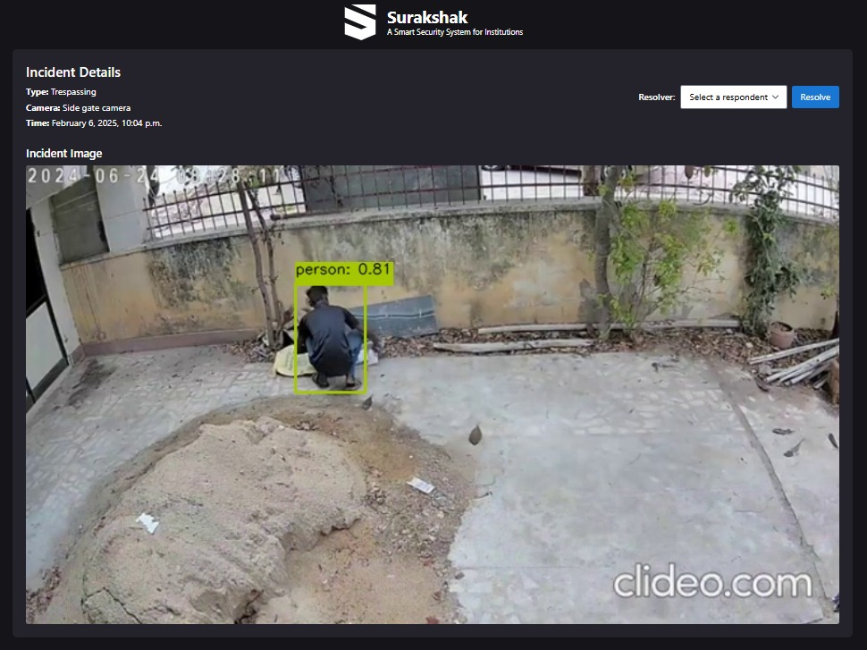
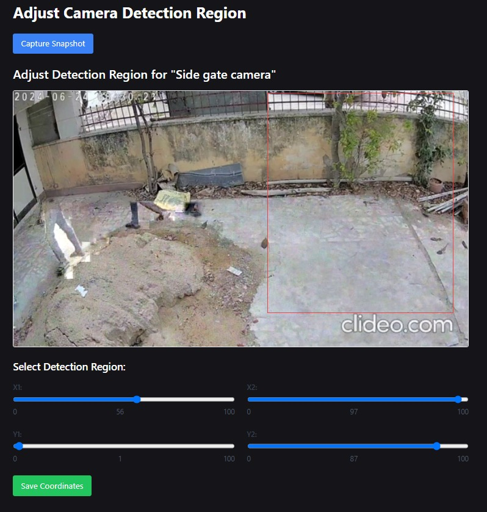
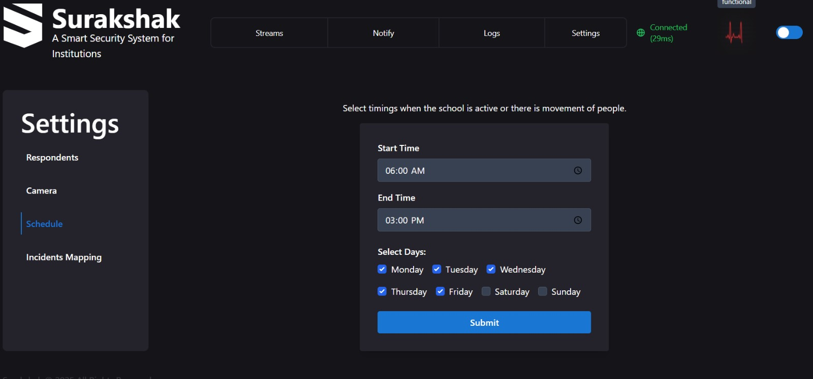
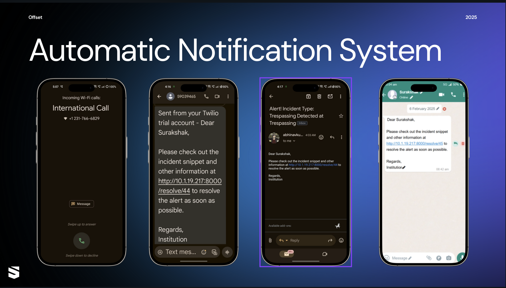
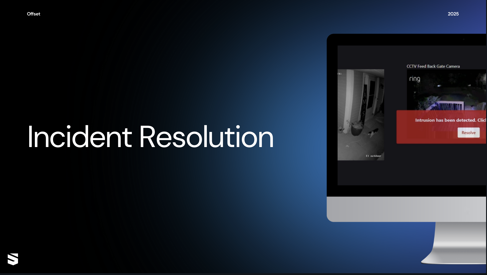

# **Surakshak**  

A **smart security system** designed for **institutions** to enhance **surveillance and monitoring**.  

## **Problem Statement**  
Ensuring the **detection and notification** of unauthorized events on school premises using **multiple CCTV feeds**.  

## **Solution**  

### **Intrusion Detection**  
We utilize a **waterfall algorithm** to detect human intrusion on the premises.  

1. **Frame Differencing**: Detects movement by analyzing differences between consecutive frames.  
2. **Object Detection**: When suspicious activity is detected, the **YOLO11s model** identifies objects in the frame and notifies the authorities accordingly.  

  

### **Inference Area Selection**  
Users can **define custom boundaries** to monitor only specific areas within their institution, reducing unnecessary alerts.  

  

### **Automatic Scheduler**  
The system allows users to **schedule active hours** when surveillance should be disabled, ensuring that monitoring is paused during institution working hours.  

  

### **Real-time Notifications**  
Users can customize **notification preferences** and select specific events for alerts. **Respondents receive a secure URL** with incident details, enabling them to take immediate action.  

### **Remote Incident Resolution**
In the event of an incident, users can **use remote links** to view snapshot of the incident, communicate with on-site personnel, and resolve the situation.

## **Key Features**  
✔️ **Human Intrusion Detection**  
✔️ **Customizable Inference Area**  
✔️ **Automated Scheduling**  
✔️ **Real-time Alerts with Remote Access**  
✔️ **Incident Resolution via Remote Interface**  

## **Demos**  

<video controls src="assets/demo.mp4"></video>

## **Tech Stack**  
- **Django** – Backend framework  
- **Python** – Core programming language  
- **Twilio** – SMS & Call Notifications  
- **Tailwind** – UI Styling  
- **OpenCV** – Computer Vision Processing  
- **Ultralytics** – YOLO-based Object Detection  

## **Upcoming Features**  
🔹 **Additional event detection** (e.g., fights, unattended objects)  
🔹 **Remote system maintenance and monitoring**  
🔹 **Facial recognition** for authorized personnel  
🔹 **Integration with local law enforcement** for high-priority incidents  

## **Credits**  
**Offset 2025. All rights reserved.**  
